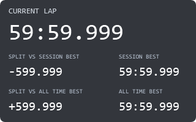

# Advanced Lap Timer

**guysmiley222 - Advanced Lap Timer** is a separate 320 × 200 overlay derived from Basic Lap Timer. It keeps the current lap on top, with smaller numbers and two comparison rows:

| Left | Right |
| --- | --- |
| Split time vs session best | Session best |
| Split time vs all-time best | All-time best |



## Install

Choose a `.simhubdash` from [themed/](themed/) using GitHub's **Download raw file** button. Double-click it to import into SimHub, then add the new overlay to a Dash Studio overlay layout. Select iRacing and use windowed or borderless mode. Basic Lap Timer remains a separate dashboard.


## Choose a theme

Use the packages in [themed/](themed/). Each build compiles Current, VS Code Dark+, Dracula, Nord, Monokai, and Solarized Dark into separate dashboards. The theme is included in the filename and SimHub display name. Import the theme you want and select that variant in your overlay layout. No theme dropdown is required. Variants can coexist and retain their identity across rebuilds.

The unsuffixed package is retained for compatibility; use themed packages for theme selection.

## Timing and splits

Times use fixed-width Consolas digits and leading zeroes for a stable LCD-style layout. Laps display `mm:ss.fff` through `59:59.999`. Splits remain signed seconds with three integer digits (`+000.318` or `-599.999`), accommodating differences through 9 minutes 59.999 seconds without shifting the decimal point.

Current lap uses `DataCorePlugin.GameData.NewData.CurrentLapTime`. Best references and live splits use SimHub's built-in persistent tracker, with each delta paired to its own reference:

| Comparison | Best lap property | Delta property (seconds) |
| --- | --- | --- |
| Session | `PersistantTrackerPlugin.SessionBest` | `PersistantTrackerPlugin.SessionBestLiveDeltaSeconds` |
| All-time | `PersistantTrackerPlugin.AllTimeBest` | `PersistantTrackerPlugin.AllTimeBestLiveDeltaSeconds` |

The spelling `PersistantTrackerPlugin` is SimHub's property name. All-time best means the reference retained by **your local SimHub tracker** for its car/track combination; it is not an online world record or a downloaded iRacing personal-best history. Session best uses the same tracker as the session split to keep the comparison aligned.

Splits compare elapsed time at the same position on the lap: **negative means faster**, **positive means slower**, and zero displays `+000.000`. They are live lap deltas, not individual sector times or subtraction of the current partial lap from a full best lap.

Missing or zero reference times display `--:--.---`; a missing reference or delta displays `---.---`. SimHub must have a reference lap and tracking map before it can provide a useful live comparison. Reference selection, validity, persistence, and any transient availability during lap/session changes follow SimHub. No extra plugin or custom lap-history database is required.

## Build and verify

From this folder in a checkout of the full repository:

```powershell
python .\build.py
powershell.exe -NoProfile -STA -ExecutionPolicy Bypass -File .\preview.ps1
python .\build.py
powershell.exe -NoProfile -STA -ExecutionPolicy Bypass -File .\verify.ps1
```

Also run the repository's shared package and theme checks. Installed SimHub models, theme/fallback bindings, package contents, and sample timing expressions are verified. Preview images are static samples. Live reference-map availability, delta transitions across laps, and the displayed overlay require a practice-session check.

For acceptance, complete clean laps and compare both splits to SimHub's matching reference laps. Check faster/slower signs, a fresh session without a reference, a retained all-time reference, disconnect/reconnect, and the selected themed variants. The dashboard has its own identity and theme selection.
