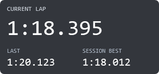

# Basic Lap Timer

A 320 × 150 SimHub overlay showing **current**, **last**, and **session-best** lap times, with white text on a translucent dark panel. Its SimHub display name is **guysmiley222 - Basic Lap Timer**.



## Install

1. [Download the dashboard](guysmiley222%20-%20Basic%20Lap%20Timer.simhubdash). On GitHub's file page, choose **Download raw file**.
2. Open SimHub, select **iRacing**, and double-click the downloaded `.simhubdash` file. Accept the import prompt.
3. In **Dash Studio → Overlays**, add **guysmiley222 - Basic Lap Timer** to an overlay layout.
4. Start the layout, position and scale the panel, then lock it using SimHub's layout controls.
5. Run iRacing in **windowed or borderless** mode and enter a practice session.

No additional plugin is required. SimHub manages placement, scaling, and locking. See [SimHub's overlay instructions](https://github.com/SHWotever/SimHub/wiki/Dash-Studio-Overlays).

If upgrading from **iRacing Lap Timer Prototype**, import this renamed package and select it in your layout in place of the old entry.

## Behavior

- Times use `m:ss.fff`. Zero or missing values show `--:--.---`, including briefly at the start of a lap.
- When iRacing is disconnected or another game is active, the header reads **Waiting for iRacing** and the times show placeholders.
- Best comes from SimHub's current-session `BestLapTime`. Lap validity, timing, and session resets follow SimHub; this overlay stores no lap history.
- The panel remains available while idle and in the pits.
- Displaying milliseconds does not change the telemetry refresh rate.

The time bindings are `DataCorePlugin.GameData.NewData.CurrentLapTime`, `LastLapTime`, and `BestLapTime`. The connection check uses `DataCorePlugin.GameRunning` and `DataCorePlugin.CurrentGame == 'IRacing'`.

## Verification

The original prototype's import, display, and corrected live connection were confirmed in a practice session. The renamed package passes loading checks against installed SimHub dashboard models, NCalc sample-time and connection-state checks, and package structure checks. A static WPF layout preview was rendered and visually inspected. The renamed package's UI import has not been separately tested.

The NCalc checks use .NET equivalents for SimHub's `format`, `replace`, and `isnull` handlers. They cover minute rollover, missing and zero values, independent lap bindings, session reset, disconnect, another game, and reconnect. They do not replace a live overlay test.

For live acceptance, confirm the timer advances, last updates after crossing the line, best improves after a faster valid lap, and values reset with a new session. Exit and reconnect to check the waiting state and recovery. Lock the layout and confirm mouse input reaches iRacing underneath it.

## Rebuild

The `dashboard/guysmiley222 - Basic Lap Timer/` folder contains editable `.djson` source, metadata, thumbnails, and the resource archive. `build.py` uses only Python's standard library. From this folder, run:

```powershell
python .\build.py
powershell.exe -NoProfile -STA -ExecutionPolicy Bypass -File .\preview.ps1
python .\build.py
powershell.exe -NoProfile -STA -ExecutionPolicy Bypass -File .\verify.ps1
```

The PowerShell scripts require Windows PowerShell 5.1. Verification loads your locally installed SimHub assemblies; pass `-SimHubPath` if SimHub is installed somewhere other than its default location. The process-level execution policy option does not change your saved system policy.

Add `-Live` to `verify.ps1` to evaluate the formulas using the running SimHub server's iRacing telemetry at `http://localhost:8888`. The layout preview uses sample values and is not a screenshot of the running overlay.
