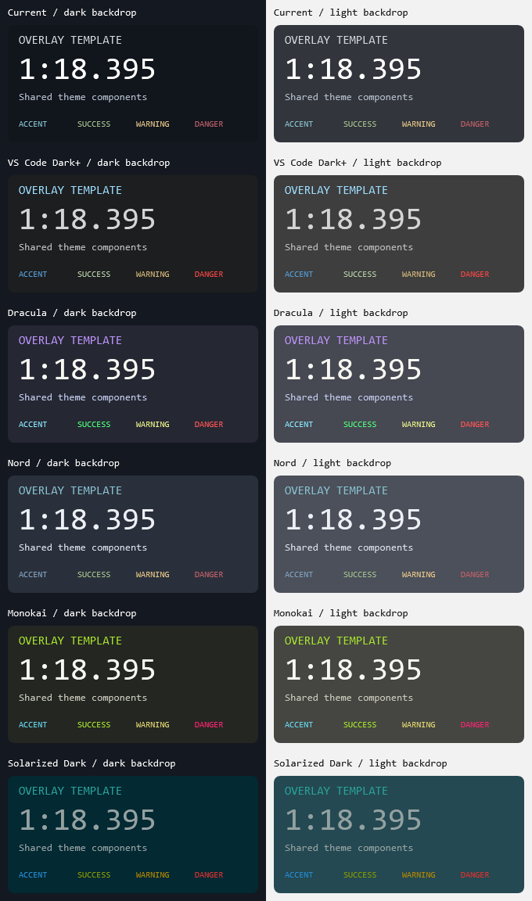

# Overlay Template

A working themed starter for future **guysmiley222** SimHub overlays. The sample shows title, primary value, supporting text, and accent/success/warning/danger roles.



## Create an overlay

1. Clone or download the whole repository, then copy this folder alongside it and give the copy your overlay's name. Keep `shared/` at the repository root.
2. Edit `build.py`: set `NAME`, description, version, and sample contents. Generate new `DASHBOARD_ID` and `SCREEN_ID` once, for example with `python -c "import uuid; print(uuid.uuid4())"`. Retain those IDs for subsequent versions.
3. Add components through `panel()` and `text()`. Use semantic color roles instead of literal colors, and pass telemetry formulas through `expression`.
4. From the new folder, run the commands below. Update the display name passed by `preview.ps1` to match your new `NAME`.
5. Import the generated `.simhubdash`. Choose a package from `themed/`; the theme is in its filename and display name. No runtime dropdown is needed.

```powershell
python .\build.py
powershell.exe -NoProfile -STA -ExecutionPolicy Bypass -File .\preview.ps1
python .\build.py
```

The resulting package includes theme bindings and notices and can be installed without the repository. [Shared foundation documentation](../shared/README.md) describes the builder interface and verification workflow.

The supplied **guysmiley222 - Overlay Template.simhubdash** is a static demonstration, not a live timer. Confirm themed variants and any new telemetry bindings in SimHub before publishing a new overlay.
