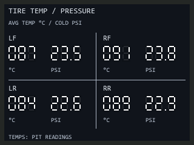
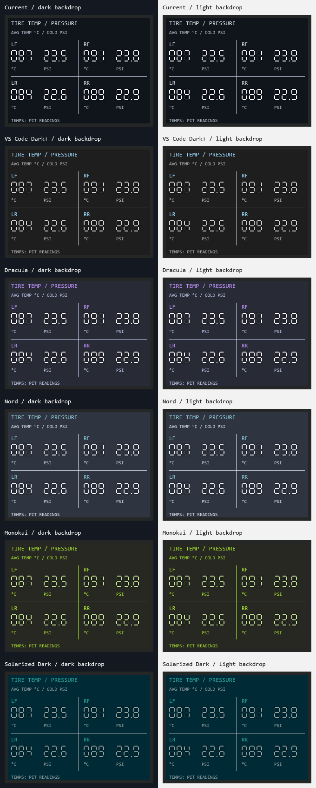

# Tire Temp and Pressure - retro

**guysmiley222 - Tire Temp and Pressure - retro** — 320 × 240, four corners arranged LF/RF above LR/RR. Each shows average carcass temperature in °C and garage cold pressure in PSI.



Opaque charcoal bezel, square LCD face and native seven-segment digits, matching the retro Advanced Lap Timer. No extra fonts needed.

## Install

Choose a package in [themed/](themed/): Current, VS Code Dark+, Dracula, Nord, Monokai or Solarized Dark. Double-click to import into SimHub and add it through Dash Studio Overlays. Use windowed/borderless iRacing. Each variant has an independent stable identity. The unsuffixed package is a compatibility export.

## Readings

Temperature averages `DataCorePlugin.GameRawData.Telemetry.<corner>tempCL`, `tempCM`, `tempCR` (°C). Pressure uses `<corner>coldPressure` (kPa), divided by 6.894757293168 for PSI. Corners are LF, RF, LR, RR. These channels are present in installed SimHub iRacing sample data.

**Cold pressure is the garage setting, not hot running pressure.** Temperatures follow the last available pit measurement; they are not live on-track temperatures. See [iRacing tire information](https://support.iracing.com/support/solutions/articles/31000167257-black-box-screen-information-and-controls). The dashboard labels both limitations explicitly.

Missing data or disconnection displays `---`. Zero temperature is valid; nonpositive pressure is unavailable. Supported display ranges are 0–999 °C and 0–99.9 PSI; readings beyond them display `---`. Units are fixed, independent of SimHub preferences. No universal temperature thresholds are implied.

## Build and verify

```powershell
python .\build.py
powershell.exe -NoProfile -STA -ExecutionPolicy Bypass -File .\preview.ps1
python .\build.py
powershell.exe -NoProfile -STA -ExecutionPolicy Bypass -File .\verify.ps1
```

Static previews are sample readings. Live import, raw property availability on the user's car, pit updates, disconnect/reconnect and placement require a running iRacing session.


